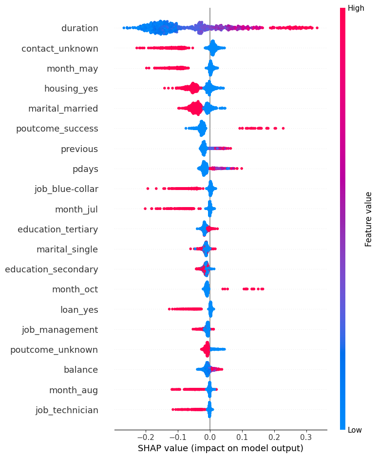

#Machine Learning for Predictive Risk Analytics
## Predictive Modeling & Risk Optimization

Engineered a predictive machine learning pipeline in Python to optimize communication channel selection for debt collection, directly targeting operational inefficiencies.

### 🚀 Key Features & Methodology
* **Class Imbalance Management:** Handled highly imbalanced operational datasets using **SMOTE** (Synthetic Minority Over-sampling Technique) to ensure robust minority class representation and mitigate prediction bias.
* **Evaluation Framework:** Evaluated model performance anomalies utilizing strict threshold-independent metrics, monitoring **AUC-ROC** and **F1-scores** to optimize operational target selection.
* **Model Explainability:** Integrated **SHAP (SHapley Additive exPlanations)** frameworks to ensure algorithmic risk decisions and data patterns are transparent, interpretable, and fully ready for operational auditing.

### 📊 Explainability Insights
Below is the feature importance summary map generated by the SHAP framework. This framework highlights how customer balances, communication durations, and specific contact methods directly drive the model's predictive risk decisions:



### 🛠️ Setup & Execution Instructions
1. Clone this repository:
   ```bash
   git clone [https://github.com/YOUR_GITHUB_USERNAME/credresolve-ml-challenge.git](https://github.com/YOUR_GITHUB_USERNAME/credresolve-ml-challenge.git)
   cd credresolve-ml-challenge
